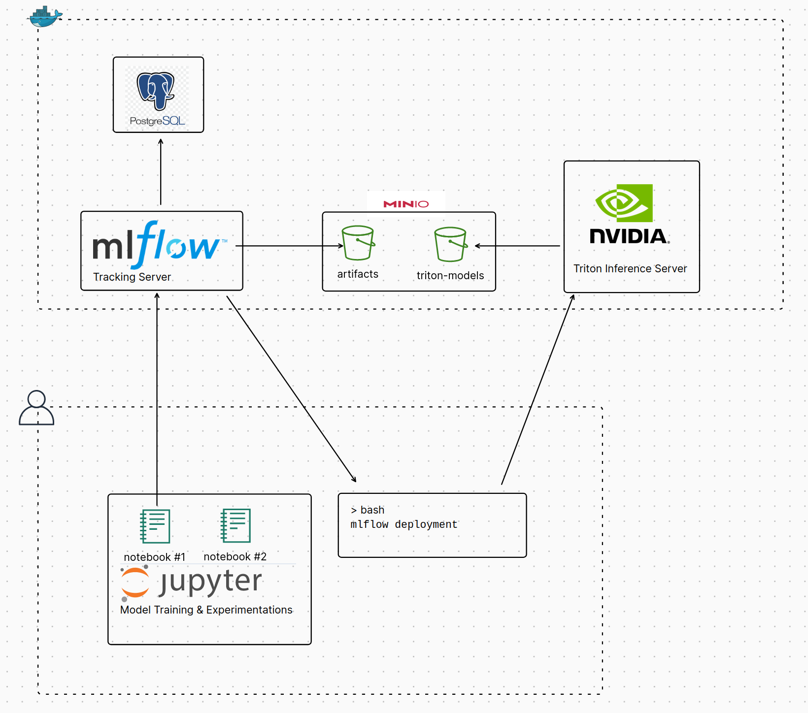

# MLflow Triton Plugin Demo

## Introduction

The project aims to demonstrate a simple workflow articulated around the open source projects [MLFlow](https://mlflow.org/) and [Triton Inference Server](https://github.com/triton-inference-server).

MLflow and Triton Inference Server, when combined, provide a powerful solution to streamline the MLOps workflow. MLflow is an open-source platform that manages the entire machine learning lifecycle, including experimentation, reproducibility, and deployment. On the other hand, Triton Inference Server is an open-source inference serving software that lets teams deploy trained AI models from any framework on any GPU- or CPU-based infrastructure. The integration of MLflow with Triton Inference Server allows for seamless transition from model training to deployment, ensuring models are efficiently delivered into production.

The [mlflow-triton-plugin](https://github.com/triton-inference-server/server/tree/main/deploy/mlflow-triton-plugin) is used to streamline the deployment of the models from mlflow into the triton inference server.

## Requirements

- Python
- Docker + docker-compose
- [asdf](https://asdf-vm.com/) (recommanded - to setup a dev environment without the hassle)
- [nvidia-container-toolkit](https://github.com/NVIDIA/nvidia-container-toolkit) (optional - for GPU accelerated inference)

`asdf` requires the following plugins :
```
asdf plugin-add python
asdf plugin-add direnv
```

Note that additional steps might be required to setup direnv properly, please refer to this [link](https://github.com/asdf-community/asdf-direnv) for further instructions. Be aware that restarting your shell session might be required after installing direnv for the first time.

## Architecture

The user space defines the development environment used by a human operator. It includes both the Jupyter notebooks running the AI experiments and the terminal from which MLflow commands are dispatched. The backend services are a collection of containerized applications used to host the required services for storing, instrumenting, and executing the inference models. With this setup, all assets are stored in an online object storage service, represented by the minio server running in Docker.

<p align="center">
  
</p>

## Instructions

1. Setup environment

If using asdf :
```
asdf install
```

Otherwise, python must be installed separatly and environment variables from `.env` must be set accordingly.

2. Install dependencies

A good practice is to use a virtualenv to isolate this project from the host. Using asdf+direnv plugin would do that for you seamlessly.

```
python -m pip install -r requirements.txt
```

3. Start docker containers

```
docker compose -f docker-compose.yml up
```

To take advantage of an nvidia GPU, use `docker compose -f docker-compose.yml -f docker-compose-nvidia.yml up` instead.

4. Run jupyter notebook and follows instructions

Choose one of the experimentation notebooks, and run it with :

```
python -m jupyter lab experiment_elasticnet.ipynb
```